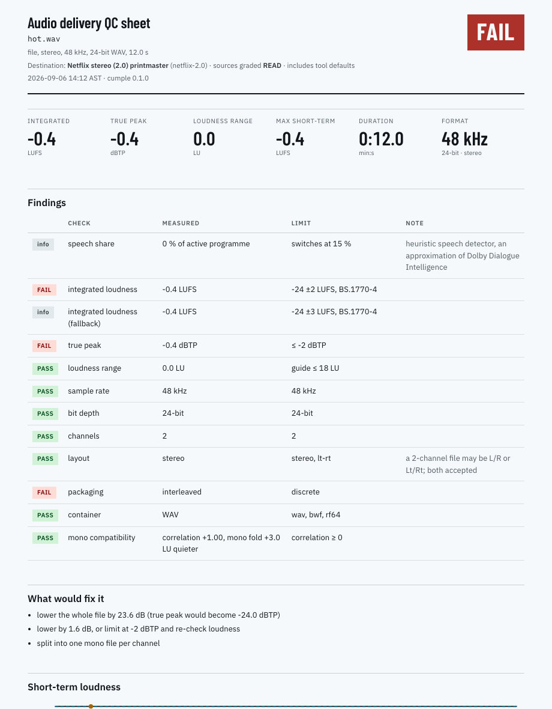
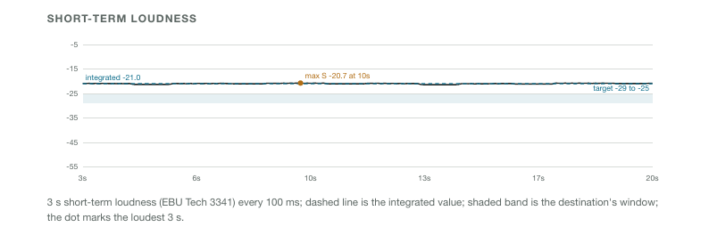
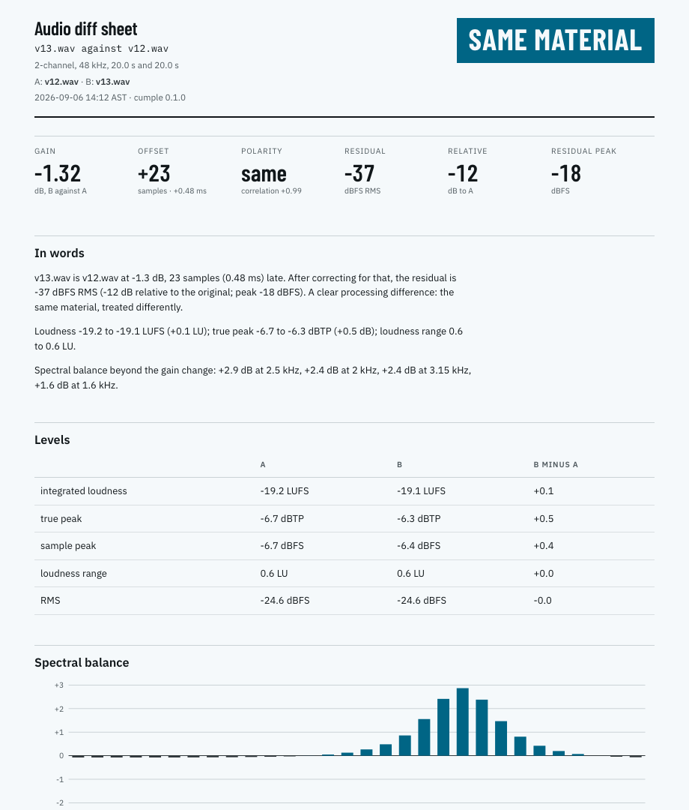

# cumple

**Delivery QC for audio.** *¿Cumple?* Does this file comply?

Point cumple at a WAV, a bounce folder or a whole delivery package and name the
destination: Netflix, Apple TV+, Max, Amazon, EBU R 128, ATSC A/85, a cinema
trailer, Spotify, an audiobook. It measures the audio the way that destination
measures it, tells you exactly which rule fails, quotes the rule, and suggests
the fix. A second command says in words how two audio files differ, or whether
a set of stems still sums to the printmaster.

<p align="center"></p>

## Who it is for

Re-recording mixers, mastering engineers, post supervisors, and anyone who has
bounced a printmaster late at night and wondered whether it will come back from
the platform's QC. cumple lives where deliveries live: the bounce folder, a QC
sheet that travels with the files, a watch folder, and a drag-and-drop app on
the Mac. There is JSON output and an exit code for anyone who wants to script
it, but nothing here depends on a terminal, a server, or GitHub.

## Sixty-second start

Needs Python 3.12 or newer and [uv](https://docs.astral.sh/uv/). The test
suite runs on 3.12; the tool also runs on 3.14.

```
uv tool install --python 3.12 git+https://github.com/victor10days/cumple
cumple check master.wav --spec netflix-2.0
```

From a clone, `uv tool install --python 3.12 .` does the same. No audio at
hand? `uv run python scripts/make_demo.py ~/cumple-demo` writes a seeded set of
synthetic bounces, stems, a 5.1 package and two mix versions to try every
command on. What you get:

```
cumple-hot.wav  file, stereo, 48 kHz, 12.0 s
against Netflix stereo (2.0) printmaster (netflix-2.0, sources graded READ)
       check                   measured                limit                  note
────────────────────────────────────────────────────────────────────────────────────────────────────
info   speech share            0 % of active           switches at 15 %       heuristic speech
                               programme                                      detector, an
                                                                              approximation of Dolby
                                                                              Dialogue Intelligence
FAIL   integrated loudness     -0.4 LUFS               -24 ±2 LUFS,
                                                       BS.1770-4
info   integrated loudness     -0.4 LUFS               -24 ±3 LUFS,
       (fallback)                                      BS.1770-4
FAIL   true peak               -0.4 dBTP               ≤ -2 dBTP
PASS   loudness range          0.0 LU                  guide ≤ 18 LU
PASS   sample rate             48 kHz                  48 kHz
PASS   bit depth               24-bit                  24-bit
PASS   channels                2                       2
PASS   layout                  stereo                  stereo, lt-rt          a 2-channel file may
                                                                              be L/R or Lt/Rt; both
                                                                              accepted
FAIL   packaging               interleaved             discrete
PASS   container               WAV                     wav, bwf, rf64
PASS   mono compatibility      correlation +1.00,      correlation ≥ 0
                               mono fold +3.0 LU
                               quieter
FAIL  Netflix stereo (2.0) printmaster
  fix: lower the whole file by 23.6 dB (true peak would become -24.0 dBTP)
  fix: lower by 1.6 dB, or limit at -2 dBTP and re-check loudness
  fix: split into one mono file per channel
```

The packaging line is a real Netflix clause: original-language masters go up
as one mono file per channel, so an interleaved stereo bounce fails there even
when the numbers are right. Exit code 0 on PASS, 1 on FAIL, 2 when the file
could not be read. Add `--clauses` to print the source's words under each
finding, `--sheet` for the QC sheet, `--json` for machines.

## What it measures

- **Loudness per ITU-R BS.1770-5**: integrated, short-term, momentary and
  loudness range (EBU Tech 3341 and 3342). The relative gate can be switched
  off, because BS.1770-1, which Netflix and Amazon cite, has none.
- **Dialogue-gated loudness**, the way streaming studios measure, using a
  heuristic speech detector that is labelled everywhere as an approximation of
  Dolby Dialogue Intelligence. The measured speech share drives the "under 15 %
  dialogue" switch in the Netflix, Disney+, Apple TV+ and ATSC rules, and the
  Netflix QC rule of re-measuring full programme before flagging is built in.
- **True peak** with the 4x oversampling filter printed in BS.1770 Annex 2, and
  sample peak for specs that say "peak" without "true".
- **Leq(m)** for cinema trailers and adverts, with the M-weighting designed from
  the response table in the TASA standard.
- **Format**: sample rate, bit depth, channel count, layout, SMPTE or Film
  channel order, discrete or interleaved packaging, container, and whether the
  LFE carries full-range content (an Apple clause). An eight-channel file is
  told apart as 7.1 or as a 5.1 with its own stereo fold-down on tracks 7 and
  8 (the Fox, CBS, Hulu and Disney trailer layout) by how well the pair
  correlates with a fold of the bed; the bed alone is measured.
- **Signal**: head and tail padding, clipping runs, DC offset, silent channels,
  mono fold-down (UK DPP), ACX RMS level and noise floor, duration caps.
- **Metadata**: embedded BWF loudness values against the measurement
  (EBU Tech 3285).
- **Stems**: DX + MX + FX against the printmaster, and no speech in the M&E.

Everything streams: a two-hour 5.1 file runs in constant memory
([docs/PERF.md](docs/PERF.md)).

## Commands

### `check`: a file, or a whole package

A directory of discrete mono files is one deliverable. Channel roles come from
the filename suffixes (`_L`, `_R`, `_C`, `_LFE`, `_Ls`, `_Rs`, `_Lt`, `_Rt`),
which is how Amazon asks for 5.1.

```
$ cumple info ./EP101_delivery
package EP101_delivery: 5.1

  role   file                  rate    depth   channels   duration
 ──────────────────────────────────────────────────────────────────
  C      EP101_PM_51_C.wav     48000   24      1          20.000 s
  L      EP101_PM_51_L.wav     48000   24      1          20.000 s
  LFE    EP101_PM_51_LFE.wav   48000   24      1          20.000 s
  Ls     EP101_PM_51_Ls.wav    48000   24      1          20.000 s
  R      EP101_PM_51_R.wav     48000   24      1          20.000 s
  Rs     EP101_PM_51_Rs.wav    48000   24      1          20.000 s

$ cumple check ./EP101_delivery --spec amazon-5.1-package
EP101_delivery  package, 5.1, 48 kHz, 20.0 s
against Amazon MGM Studios 5.1 (discrete mono files) (amazon-5.1-package, sources graded READ)
       check                   measured                limit                   note
────────────────────────────────────────────────────────────────────────────────────────────────────
info   speech share            100 % of active         switches at 15 %        heuristic speech
                               programme                                       detector, ...
FAIL   dialogue-gated          -19.9 LKFS              -27 ±2 LKFS,            approximation of
       loudness                                        BS.1770-1               Dialogue Intelligence:
                                                                               heuristic speech gate,
                                                                               143 speech blocks,
                                                                               BS.1770-1 (no relative
                                                                               gate)
PASS   true peak               -4.2 dBTP               ≤ -2 dBTP
PASS   sample rate             48 kHz                  48 kHz
PASS   channels                6                       6
PASS   layout                  5.1 (L, R, C, LFE,      5.1
                               Ls, Rs)
PASS   packaging               discrete                discrete
PASS   LFE content             -39.3 dB of its         below -15 dB (tool      checked above 240 Hz,
                               energy above 240 Hz     default)                one octave over the
                                                                               120 Hz corner, where
                                                                               a 24 dB/octave
                                                                               low-pass leaves -24 dB
PASS   head padding            0.00 s                  ≤ 2 s
FAIL  Amazon MGM Studios 5.1 (discrete mono files)
  fix: lower the whole file by 7.1 dB (true peak would become -11.3 dBTP)
```

### The QC sheet

`cumple check master.wav --spec max-wbd --sheet` writes `master.qc.html` next
to the file; `--pdf` also prints it through a local Chrome or Chromium, and
`--out DIR` puts both somewhere else. The sheet is what you send with the
delivery: verdict, the six headline numbers, every finding with its limit and
the source's words, what would fix it, a short-term loudness timeline, and the
sources with their grades and retrieval dates. It carries its own type (IBM
Plex and Barlow Condensed, subset and embedded under the SIL Open Font
License), so it reads the same offline, on a phone and in the PDF; the system
behind it is `design.md` and `src/cumple/report/tokens.css`.

<p align="center"></p>

### `watch`: a folder that QCs every bounce

```
$ cumple watch ~/Bounces --spec netflix-2.0
watching /Users/me/Bounces against Netflix stereo (2.0) printmaster; files are measured 5 s after
they stop growing
FAIL cumple-hot.wav  -0.4 LUFS, -0.4 dBTP  integrated loudness, true peak, packaging  → cumple-hot.qc.html
FAIL cumple-ok.wav  -26.5 LUFS, -26.5 dBTP  packaging  → cumple-ok.qc.html
FAIL cumple-v12.wav  -16.0 LUFS, -7.5 dBTP  integrated loudness, packaging  → cumple-v12.qc.html
```

Every file that lands gets a sheet next to it and a line in `cumple-log.csv`
in the same folder (time, file, profile, verdict, integrated, true peak, LRA,
duration, failed checks, sheet path). A file that is still being written is
left alone until its size and modification time have been stable for
`--stable` seconds. Sources are never modified or moved. `--once` runs a
single pass, `--redo` re-measures files that already have a sheet, `--pdf`
adds PDFs.

### `diff`: how do two files differ?

```
$ cumple diff v12.wav v13.wav
cumple-v13.wav is cumple-v12.wav at -1.4 dB, 23 samples (0.48 ms) late. After correcting for that,
the residual is -39 dBFS RMS (-17 dB relative to the original; peak -24 dBFS). A clear processing
difference: the same material, treated differently.
Loudness -16.0 to -16.9 LUFS (-0.9 LU); true peak -7.5 to -8.6 dBTP (-1.1 dB); loudness range 0.0 to
0.0 LU.
Spectral balance beyond the gain change: +2.9 dB at 2.5 kHz, +2.2 dB at 2 kHz, +2.1 dB at 3.15 kHz,
+1.3 dB at 1.6 kHz.
```

Offset comes from FFT cross-correlation with sub-sample refinement, polarity
from its sign, and gain from the median third-octave band delta, so an EQ
change shows up as EQ rather than being absorbed into the gain figure. The
residual is what is left after all three are corrected. Exit code 1 when the
files differ, 0 when nothing is left. `--sheet` writes `v13.diff.html` next to
the second file (`--pdf` and `--out` work as for `check`): the verdict as a
stamp, the alignment numbers, both files' levels side by side, and the
third-octave deltas as bars with the gain change removed.

<p align="center"></p>

Stems against the printmaster keep level differences, because stems must match
at level:

```
$ cumple diff DX.wav MX.wav FX.wav --against PM.wav
the sum of the stems is cumple-PM.wav with no gain, offset or polarity change. After correcting for
offset and polarity (level differences are kept, because stems must match the printmaster at level),
the residual is -137 dBFS RMS (-114 dB relative to the original; peak -132 dBFS). Nothing is left:
the files are the same audio.
```

### `fix`: gain only, never a limiter

```
$ cumple fix master.wav --spec ebu-r128 --out master.r128.wav
wrote master.r128.wav: apply -22.60 dB  (loudness -0.4 → -23.0 LUFS, true peak -0.4 → -23.0 dBTP)
note: the copy carries no bext/iXML metadata; re-embed it in your DAW if the destination requires it
re-check: PASS
```

When gain alone cannot satisfy both the loudness window and the peak ceiling,
cumple refuses, because limiting is a creative decision:

```
$ cumple fix spiky.wav --spec ebu-r128 --out spiky.r128.wav
no fix written: gain alone cannot do it: loudness needs at least +2.2 dB but the peak allows at most
+1.8 dB; the mix needs headroom (limiting or a mix change is a creative decision, so cumple does not
do it)
```

### `specs` and `explain`: what does the destination actually say?

`cumple specs` lists every destination with the grade of its sources;
`--family streaming` filters, `--ids` prints ids only, `--json` and
`--markdown` exist for scripts and docs. `cumple explain netflix-2.0` prints
the rules, the clause behind each one, and every source with its grade, URL
and retrieval date.

### The Mac app

```
zsh integrations/macos/build_app.sh          # builds ~/Applications/cumple QC.app
```

Drop a WAV or a delivery folder on it, pick the destination from a list, and
the sheet opens. It is an AppleScript droplet compiled with `osacompile` that
calls the same `cumple check --sheet --pdf`; no terminal involved.

## Destinations

| id | destination | loudness | peak | grade |
|---|---|---|---|---|
| `aes-td1008-speech` | AES TD1008 streaming, speech-anchored | -19 to -17 dialogue-gated | -1 dBTP | READ |
| `amazon-2.0-package` | Amazon MGM Studios 2.0 (discrete mono files) | -27 ±2 dialogue-gated | -2 dBTP | READ* |
| `amazon-5.1-package` | Amazon MGM Studios 5.1 (discrete mono files) | -27 ±2 dialogue-gated | -2 dBTP | READ* |
| `amazon-pvd` | Prime Video Direct mezzanine audio | -24 ±2 integrated | -2 dBTP | READ |
| `apple-tv` | Apple TV+ / Apple TV app | -31 to -10 dialogue-gated; -31 to -5 integrated (speech < 15 %) | -1 dBTP | READ* |
| `atsc-a85-streaming` | ATSC A/85:2026 Annex L streaming range | -27 to -23 dialogue-gated or -27 to -23 integrated (speech < 15 %) | -2 dBTP | READ |
| `disney-a85` | Disney A85, General Entertainment (Hulu originals, ABC, FX) | -24 ±2 dialogue-gated or -24 ±2 integrated | -2 dBTP | READ |
| `disney-plus-2.0` | Disney+ near-field 2.0 stereo | -24 ±0.4 integrated | -2 dBTP | READ |
| `disney-plus-5.1` | Disney+ near-field 5.1, 7.1 and Atmos | -27 ±0.4 dialogue-gated; -24 ±0.4 integrated (speech < 15 %); ≤ -20 integrated | -2 dBTP | READ |
| `disney-r128` | Disney R128 (dubs and territories on R 128) | -23 ±0.5 integrated | -3 dBTP | READ |
| `disney-trailer` | Disney in-home trailer (Digital Supply Chain) | -24 ±2 integrated | -2 dBTP | READ |
| `hulu-2018` | Hulu content partner guidebook (2018, stale) | -24 ±2 integrated | -2 dBFS sample | READ |
| `max-wbd` | Warner Bros. Discovery / Max component audio | -24 ±2 dialogue-gated or -24 ±2 integrated | -2 dBTP | READ |
| `netflix-2.0` | Netflix stereo (2.0) printmaster | -27 ±2 dialogue-gated or -24 ±2 integrated (speech < 15 %) | -2 dBTP | READ* |
| `netflix-5.1` | Netflix 5.1 near-field printmaster | -27 ±2 dialogue-gated or -24 ±2 integrated (speech < 15 %) | -2 dBTP | READ* |
| `paramount-pluto` | Paramount Global content delivery (Pluto TV ingest) | -24 ±2 integrated | -2 dBFS sample | READ* |
| `peacock` | Peacock (NBCUniversal, community-reported) | -27 ±2 dialogue-gated | none stated | COMMUNITY* |
| `abc-commercial` | ABC commercial file delivery HD (Disney Advertising) | -26 to -23 integrated | -6 dBTP | READ |
| `arib-tr-b32` | ARIB TR-B32 (Japan television) | -24 ±1 integrated | -1 dBTP | SECONDARY |
| `atsc-a85-2026` | ATSC A/85:2026 television (US) | -24 ±2 dialogue-gated or -24 ±2 integrated (speech < 15 %) | -2 dBTP | READ |
| `cbs-commercial` | CBS Television Network commercial (Paramount) | -24 ±2 integrated | -2 dBTP | READ |
| `dpp-as11` | UK DPP / AS-11 programme delivery | -23 ±0.5 integrated | -1 dBTP | READ |
| `ebu-r128` | EBU R 128 broadcast programme | -23 ±1 integrated | -1 dBTP | READ* |
| `ebu-r128-s1-short` | EBU R 128 s1 short-form (adverts, promos) | -23 ±0.2 integrated | -1 dBTP | READ |
| `fox-commercial-2024` | Fox Networks commercial material (2024) | -24 ±2 integrated | -6 dBFS sample | READ* |
| `fox-program-2018` | Fox Networks broadcast program material (2018) | -24 ±2 integrated | -2 dBTP | READ* |
| `nbcu-commercial` | NBCUniversal linear commercial | -24 ±2 integrated | -2 dBTP | READ |
| `op-59` | Free TV Australia OP-59 | -24 ±1 integrated | -2 dBTP | READ |
| `dcp-5.1` | DCP 5.1 audio (ISDCF channel order) | no loudness target | none stated | READ |
| `sawa-ad` | Cinema advertising (SAWA) | ≤ 82 dB Leq(m) | none stated | READ |
| `tasa-trailer` | Cinema trailer (TASA) | ≤ 85 dB Leq(m) | none stated | READ |
| `aes-td1008-music` | AES TD1008 streaming, music | -16 ±0.2 integrated | -1 dBTP | READ |
| `apple-digital-masters` | Apple Digital Masters | no loudness target | -1 dBTP | READ* |
| `apple-immersive` | Apple Music immersive audio (Dolby Atmos, 5.1, 7.1) | ≤ -18 integrated | -1 dBTP | READ* |
| `soundcloud` | SoundCloud master | -14 ±1 integrated | -1 dBTP | READ* |
| `spotify` | Spotify music master | -14 ±1 integrated | -1 dBTP | READ* |
| `youtube` | YouTube (community-measured) | -14 ±1 integrated | -1 dBTP | COMMUNITY |
| `apple-podcasts` | Apple Podcasts | -16 ±1 integrated | -1 dBTP | READ |
| `acx` | ACX / Audible audiobook | -23 to -18 dBFS RMS | -3 dBFS sample | READ |

Loudness values are LUFS or LKFS; dialogue-gated rules follow BS.1770-1 with
the speech gate, integrated ones BS.1770-4. The **grade** says how the numbers
were obtained: **READ**, the primary document was read directly; **SE**, the
primary page is a JavaScript app and the values came from search extraction;
**GATED**, a partner portal, values from secondary summaries; **SECONDARY**,
another standards body's summary table; **COMMUNITY**, the platform publishes
nothing and the number is third-party measurement. An asterisk marks a profile
where some value (a tolerance, a null-test residual) is the tool's own default
because the source is silent, and the profile says so. Delivery specs change
without notice; every source carries its retrieval date. The full matrix with
sources and clauses is [docs/SPECS.md](docs/SPECS.md).

Sony Pictures, Lionsgate, Starz, Universal Pictures, Paramount+ originals, HBO and
Max, Warner Bros. Pictures theatrical and NBCUniversal's Peacock publish no delivery
specification a tool can quote; [docs/SPECS.md](docs/SPECS.md) records the search
with its date rather than inventing a number.

## Add your own destination

A destination is one YAML file. Drop it in `~/.config/cumple/profiles/` and it
appears in `cumple specs`; the same `id` as a built-in overrides it. The schema
(`src/cumple/specs/schema.py`) rejects unknown keys, so typos fail loudly.

```yaml
id: station-spot
name: Local station, 30 s spots
family: broadcast
summary: Spots for a local station. -24 LKFS ±2, -2 dBTP, 48 kHz 24-bit stereo.
loudness:
  rules:
    - method: integrated
      standard: bs1770-4
      target: -24.0
      tolerance: 2.0
peaks:
  true_peak_max: -2.0
format:
  sample_rates: [48000]
  bit_depths: [24]
  layouts: [stereo]
clauses:
  loudness.integrated: "Deliver at -24 LKFS ±2 LU measured per ATSC A/85. (station delivery memo, 2026)"
provenance:
  - title: "Audio delivery memo"
    publisher: The station
    retrieved: 2026-09-04
    grade: READ
```

[CONTRIBUTING.md](CONTRIBUTING.md) has the rules for a profile that will be
merged, starting with: every number has a source, and where the source is
silent the profile says so.

## How we know the numbers are right

- **Conformance**: all 29 cases of the official EBU Loudness Test Set v5.0
  (Tech 3341 loudness and true peak, Tech 3342 loudness range), 66 of 66
  readings inside the published tolerances; the true-peak filter against an
  independent design; the M-weighting against every row of the TASA table.
  [docs/CONFORMANCE.md](docs/CONFORMANCE.md), regenerated by
  `scripts/conformance_report.py`.
- **Benchmark**: the same files through ffmpeg's `ebur128` and pyloudnorm,
  side by side. [docs/BENCHMARK.md](docs/BENCHMARK.md).
- **Performance**: a 60-minute stereo file and a 30-minute 5.1 file, wall time
  and peak memory. [docs/PERF.md](docs/PERF.md).
- **Real dialogue**: the speech gate against two open films that publish a
  music-and-effects version of their mix, clean speech, and music without
  dialogue, with Silero VAD as a second opinion.
  [docs/DIALOGUE.md](docs/DIALOGUE.md), regenerated by
  `scripts/dialogue_benchmark.py` after `scripts/fetch_real_dialogue.sh`.
- **Tests**: 148, 92 % line coverage on `src/`, run with `uv run pytest`. The
  EBU cases run when the test set is in `~/.cache/cumple/` (it is free but not
  redistributed; see CONTRIBUTING).
- **Manual QA** on real bounces is logged in [docs/QA.md](docs/QA.md).

## Honest limits

- The dialogue gate is a heuristic (band energy, syllabic modulation, an
  adaptive floor), not Dolby's algorithm, and on film mixes it is the weakest
  meter in the tool. Measured against two open films that publish a
  music-and-effects version of their mix (where the mix rises above its
  dialogue-free twin, dialogue is present), the detector's dialogue-gated value
  read 1.6 LU low on Tears of Steel and 6.7 LU low on Sintel, whose dialogue
  sits quietly under an orchestral score: it finds dialogue in quiet scenes and
  misses it under music. On clean speech it is right, and on music and effects
  without dialogue it stays under the 15 % switch. Silero VAD, the standard
  open voice detector, is more precise and no better on the quiet dialogue.
  Method and numbers: [docs/DIALOGUE.md](docs/DIALOGUE.md). The speech share
  and the number of speech blocks are printed next to every dialogue-gated
  value so you can judge, and the full-programme value is always shown beside
  it.
- The Netflix, Disney+ and Amazon MGM Studios pages are JavaScript apps that
  refuse command-line fetchers; they were read in a browser on 2026-09-04 and
  their clauses are quoted verbatim. Weaker grades remain where the source is
  weaker: ARIB TR-B32 (SECONDARY, from an AES summary table), YouTube
  (COMMUNITY, the platform publishes nothing), Hulu (a 2018 document), and
  every profile with an asterisk carries a tool default. Treat the grade as
  part of the result.
- No Dolby Atmos or ADM checks yet: cumple reads BWF metadata but does not
  validate beds, objects or `chna` track mappings.
- Reads what libsndfile reads: WAV, BWF, RF64, AIFF, FLAC, and others. It does
  not decode delivery codecs (AAC, AC-3, MP3) or MXF; check the master.
- No 2-pop detection and no audio-to-video duration check (those need the
  picture).
- Leq(m) uses a stated convention (an M-weighted RMS of -20 dBFS on a screen
  channel is 85 dB) rather than a calibrated room. Cinema profiles say so in
  their clauses.
- Stem null tolerance (-60 dBFS residual) is cumple's default; no studio
  publishes one.
- The PDF needs a local Google Chrome or Chromium; without one, the HTML sheet
  is still written. The Mac app is macOS only; the CLI runs anywhere Python
  and libsndfile do. Tested on macOS; Linux via CI; Windows untested.

## Related work

[libebur128](https://github.com/jiixyj/libebur128) is the reference open-source
meter and passes the same EBU cases; [pyloudnorm](https://github.com/csteinmetz1/pyloudnorm)
measures integrated loudness in Python (whole file in memory); ffmpeg's
`ebur128` filter is an independent implementation.
[loudcheck](https://github.com/chaoz23/loudcheck) gives pass/fail verdicts for
EBU R 128 and ATSC A/85. [bbc/audio-offset-finder](https://github.com/bbc/audio-offset-finder)
finds offsets between recordings; [DeltaWave](https://deltaw.org/) is the
desktop null-test tool; [leqm-nrt](https://github.com/lucaTrv/leqm-nrt) measures
Leq(m). Nugen VisLM and Dolby's DPLM are the commercial meters the studios name.
cumple combines what none of them do together: named destinations with graded
sources, verdicts with the clause attached, a report that travels with the
delivery, and a diff in words.

## How AI was used

Most of this code was written with Claude. [AI_USAGE.md](AI_USAGE.md) says
what the model did, what the author decided, and the three times the model was
wrong and a test caught it.

## License

MIT. See [LICENSE](LICENSE).
